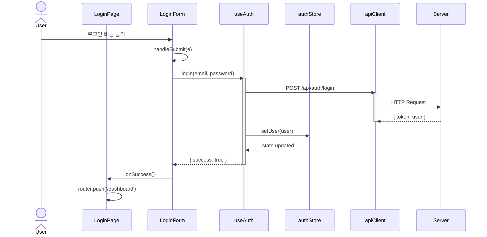
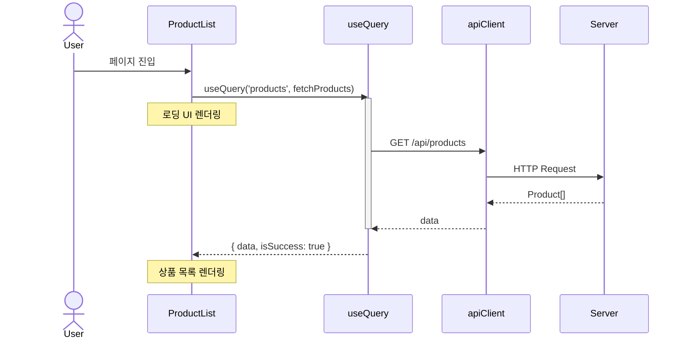
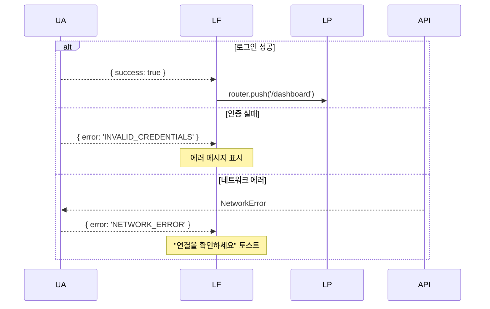
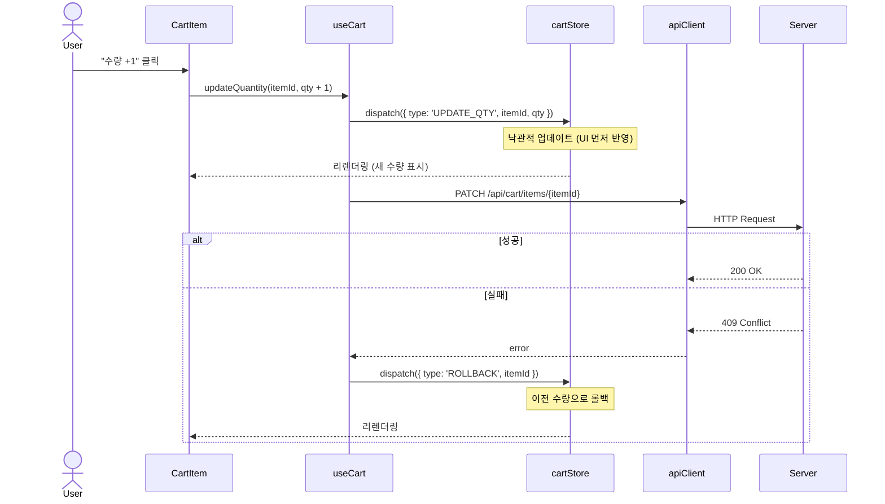

# Sequence Diagram Generator

코드베이스의 특정 기능 흐름을 분석하여 Mermaid 시퀀스 다이어그램을 생성하고 이미지로 렌더링한다.

## 워크플로우

### 1단계: 분석 대상 확인

사용자에게 AskUserQuestion으로 분석할 기능/흐름을 확인:

```
어떤 기능의 흐름을 분석할까요?
예: "로그인 폼 제출 처리", "장바구니 상품 추가", "검색 자동완성", "페이지 전환 시 데이터 로딩"
```

추가로 확인:
- 분석 깊이 (컴포넌트 레벨만 vs 훅/유틸 내부까지)
- 출력 형식 (PNG / SVG)
- 출력 경로 (기본: `docs/diagrams/`)

### 2단계: 코드 탐색 및 추적

Task 도구의 Explore 에이전트를 활용하여 관련 코드를 탐색:

1. **진입점 식별**: 사용자 인터랙션 지점 (onClick, onSubmit, 라우트 진입, useEffect 등)
2. **호출 체인 추적**: 이벤트 핸들러 → 훅 → 상태 관리 → API 호출 순서를 따라감
3. **참여자(Actor) 식별**: 각 단계가 속한 레이어를 파악
   - 예: `User`, `LoginPage`, `useAuth`, `authStore`, `apiClient`, `Server`
4. **데이터 흐름 파악**: props, state, context, API 요청/응답 데이터
5. **분기/에러 처리**: 조건부 렌더링, Error Boundary, try-catch, 로딩/에러 상태

#### 프론트엔드 참여자 레이어 가이드

| 레이어 | 예시 | 설명 |
|--------|------|------|
| User | 브라우저 사용자 | 클릭, 입력, 네비게이션 등 인터랙션 |
| Page/Layout | `LoginPage`, `DashboardLayout` | 라우트에 매핑된 최상위 컴포넌트 |
| Component | `LoginForm`, `SearchInput` | UI 컴포넌트 |
| Hook | `useAuth`, `useCart`, `useQuery` | 커스텀 훅, 데이터 패칭 훅 |
| Store/Context | `authStore`, `CartContext` | 전역/로컬 상태 관리 |
| API Client | `apiClient`, `fetch` | HTTP 요청 레이어 |
| Server | 외부 백엔드 API | 응답만 표현 (내부 구현 추적 안 함) |

각 단계마다 `파일경로:라인번호`를 기록하여 추적 가능하게 한다.

### 3단계: 다이어그램 설계

추적 결과를 사용자에게 AskUserQuestion으로 요약 제시:

```
분석 결과:

참여자: User → LoginPage → LoginForm → useAuth → authStore → apiClient → Server

흐름:
1. User: 로그인 버튼 클릭
2. LoginForm: handleSubmit() (src/components/LoginForm.tsx:28)
3. useAuth: login(email, password) (src/hooks/useAuth.ts:15)
4. apiClient: POST /api/auth/login (src/lib/api.ts:42)
5. Server: 200 OK { token, user }
6. authStore: setUser(user) (src/stores/auth.ts:20)
7. useAuth: → { isAuthenticated: true } 반환
8. LoginPage: router.push('/dashboard') (src/pages/Login.tsx:35)

이대로 다이어그램을 생성할까요? 수정할 부분이 있으면 알려주세요.
```

사용자 승인/수정 후 다음 단계로 진행.

### 4단계: Mermaid 파일 생성

`.mmd` 파일을 Write 도구로 생성:



#### Mermaid 작성 규칙

- **actor**: 사용자는 `actor` 키워드 사용
- **participant**: 짧은 alias 사용 (`UA as useAuth`)
- **실선 화살표** (`->>`) : 함수 호출, 이벤트 발생, 액션 디스패치
- **점선 화살표** (`-->>`) : 반환값, 상태 변경 알림, 콜백
- **activate/deactivate**: 비동기 작업 구간 표시 (API 호출, 데이터 패칭)
- **Note**: 중요한 로직 설명 시 `Note over UA: 토큰을 localStorage에 저장` 활용
- **alt/opt/loop**: 조건부 렌더링, 선택적 흐름, 리렌더링 사이클
- **참여자 순서**: 왼쪽(User)에서 오른쪽(Server)으로 레이어 순서대로 배치
- **주석으로 소스 위치 표기**: `%% src/hooks/useAuth.ts:15`

#### 비동기 데이터 패칭 흐름 예시



#### 조건 분기 / 에러 처리 표현



#### 상태 관리 흐름 예시



### 5단계: 이미지 렌더링

```bash
# 출력 디렉토리 생성
mkdir -p docs/diagrams

# PNG 렌더링 (기본)
npx -y @mermaid-js/mermaid-cli -i docs/diagrams/{name}.mmd -o docs/diagrams/{name}.png -t dark -b transparent -s 2

# SVG 렌더링 (사용자 요청 시)
npx -y @mermaid-js/mermaid-cli -i docs/diagrams/{name}.mmd -o docs/diagrams/{name}.svg -t dark -b transparent
```

`-s 2` 옵션으로 2배 해상도 렌더링 (선명도 향상).

렌더링 실패 시:
1. Mermaid 문법 오류 확인 후 수정
2. `npx` 사용으로 로컬 설치 없이 실행 시도
3. 그래도 실패 시 `.mmd` 파일만 제공하고 안내

### 6단계: 결과 보고

```
다이어그램 생성 완료:

- Mermaid 소스: docs/diagrams/login-flow.mmd
- 이미지: docs/diagrams/login-flow.png

참여자:
- User → LoginPage → LoginForm → useAuth → authStore → apiClient → Server

추적된 소스 파일:
- src/pages/Login.tsx:35 (페이지 컴포넌트)
- src/components/LoginForm.tsx:28 (폼 제출 핸들러)
- src/hooks/useAuth.ts:15 (인증 훅)
- src/stores/auth.ts:20 (상태 업데이트)
- src/lib/api.ts:42 (API 호출)
```

## 다이어그램 유형

기본은 시퀀스 다이어그램이지만, 흐름에 따라 다른 유형도 제안 가능:

| 유형 | 용도 | Mermaid 키워드 |
|------|------|---------------|
| sequenceDiagram | 사용자 인터랙션 흐름, 데이터 패칭, 상태 변경 | `sequenceDiagram` |
| flowchart | 조건부 렌더링 로직, 라우트 가드, 권한 분기 | `flowchart TD` |
| graph | 컴포넌트 트리, props 전달 구조 | `graph TD` |

사용자가 명시하지 않으면 **sequenceDiagram**을 기본으로 사용. 분기가 복잡한 경우 flowchart를 제안.

## 파일 명명 규칙

- 소스: `docs/diagrams/{기능명-kebab-case}.mmd`
- 이미지: `docs/diagrams/{기능명-kebab-case}.png` 또는 `.svg`
- 예: `docs/diagrams/login-flow.mmd`, `docs/diagrams/cart-update.png`

## Edge Cases

- **비동기 흐름**: `activate`/`deactivate`로 async 구간 표시. 병렬 요청은 `par` 블록 사용
- **낙관적 업데이트**: UI 먼저 반영 → API 호출 → 실패 시 롤백 순서를 명확히 표현
- **SSR/CSR 경계**: Server Component와 Client Component 간 데이터 전달은 `Note`로 경계 표시
- **Suspense/Error Boundary**: 로딩/에러 상태 전환을 `alt` 블록으로 표현
- **컴포넌트 리렌더링**: 상태 변경 후 리렌더링은 `Note over Component: 리렌더링`으로 표기
- **외부 서비스**: Server 참여자는 응답만 표현, 내부 구현은 추적하지 않음
- **순환 의존**: 부모-자식 간 콜백 체인은 `loop`이 아닌 양방향 화살표로 표현
- **너무 긴 흐름**: 20단계 이상이면 분할 제안
